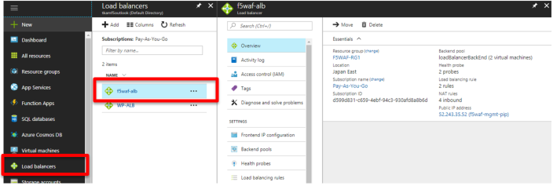
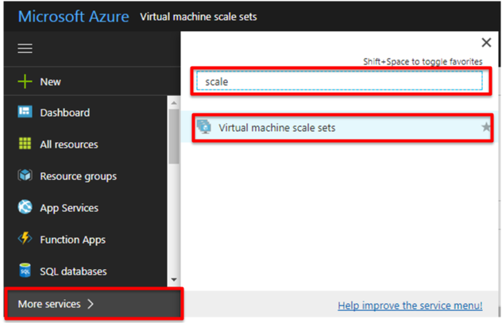
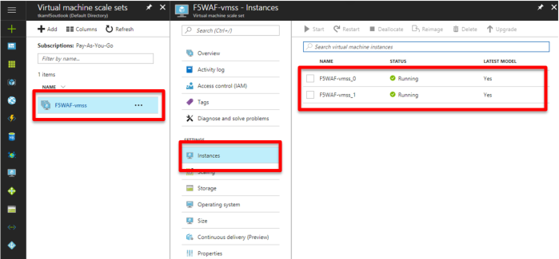
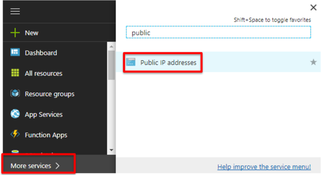
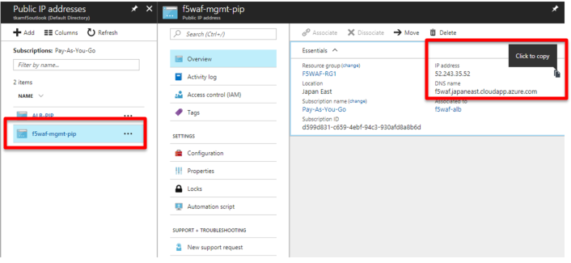

.. _module1:

ARM テンプレートによって作成されたオブジェクトの確認
====================================================

#. ARM テンプレートによって作成されたフロントエンド ALB が F5 WAF リソースグループをロードバランシング対象としていることを確認します。

   |conf1_1|

#. ハブメニューで **More services** をクリックし、”Virtual machine scale sets” を検索します。

   |conf1_2|

#. Virtual machine scale set 内に 2 つの F5 WAF インスタンス (Device Service Cluster (DSC), HA 構成) があることを確認します。 

   |conf1_3|

#. F5 WAF public IP を確認するには、More services をクリックし ”Public IP addresses” を検索します。 

   |conf1_4|
   
F5 WAF public IP address をクリックすると、F5 WAF のフロントエンド ALB のIP address と DNS名が表示されます。

   |conf1_5|

   

