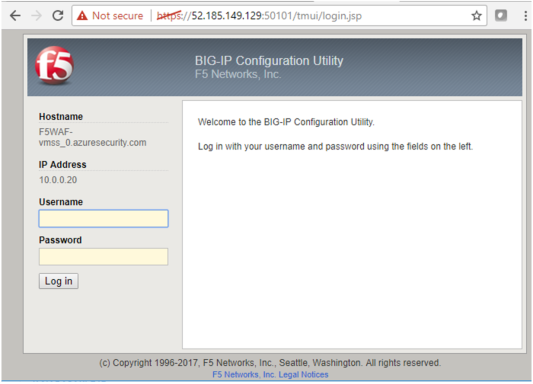
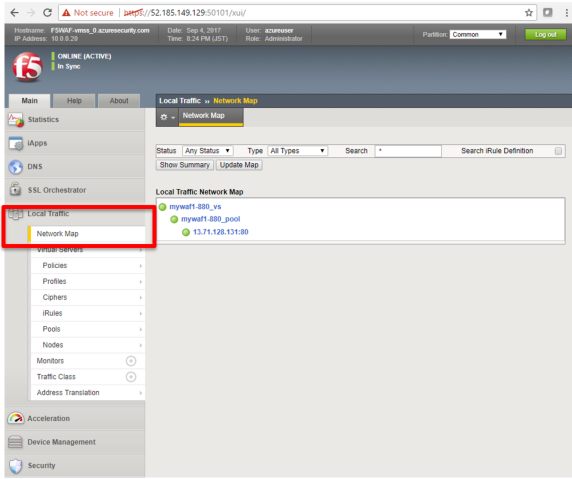
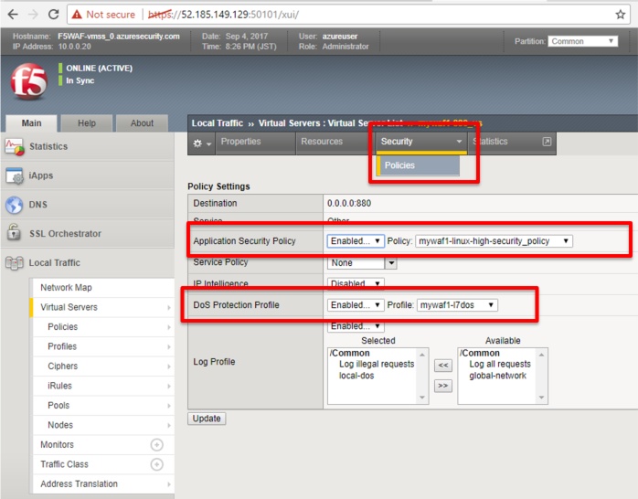

.. _module1:

F5 WAF (BIG-IP ASM) の設定確認
====================================================

#. 新しいWeb ブラウザのタブを開き、F5 WAF の IP アドレス : ポート 50101 
   にアクセスします。このポート番号は ARM テンプレート内の F5 WAF Azure Load Balancer 
   の Inbound NAT rules 設定で指定されています。

.. NOTE:: テンプレートをデプロイする際に設定したユーザー名前とパスワードでログインします。
   必要に応じて証明書の警告をスキップして下さい。 

   |conf2_1|

#. **Local Traffic** > **Network Map** 配下で表示される virtual server 
   と pool 設定を確認します。 

   |conf2_2|

#. virtual server をクリックし、 **Security** タブ配下の **** 設定で 
   Application Security Policy (WAF のセキュリティポリシー) が適用されていることを確認します。 
   
   |conf2_3|
   

