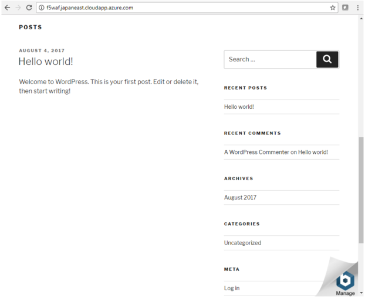

.. _module1:

WORDPRESS アプリケーションへの接続の確認
====================================================

F5 WAF 用の ALB の DNS 名で Web アプリケーションにアクセスが可能なことを確認します。
このDNS名はALB の Public IP に解決され、仮想マシンスケールセット内の  F5 WAF (BIG-IP ASM) 
宛ての通信をロードバランスします。

   |conf3_1|

