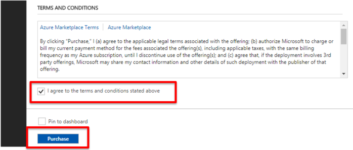

.. _module1:

ARMテンプレートをデプロイ
====================================================

#. 以下のリンクをアクセスし、Azure にデプロイするための Deploy to Azure ボタン
   をクリックします。これでGitHubリポジトリから Azure へのデプロイが簡単に展開できます。
   現在デプロイ可能な BIG-IP ライセンスは従量課金 (PAYG) のみです。

https://github.com/F5Networks/f5-azure-arm-templates/tree/master/supported/solutions/autoscale/waf/existing_stack

   |deploy_1|

#. Azure Portalの Custom deployment 画面が表示されます。このテンプレートは、
   BIG-IP を管理するための VM スケールセット、Azure ロードバランサ、仮想ネットワークなど
   のオブジェクトを作成します。
   
.. NOTE:: Azure上でデプロイされるBIG-IP VEのインスタンスサイズに関しては、以下のリンクをご参照ください。

https://support.f5.com/kb/en-us/products/big-ip_ltm/manuals/product/bigip-ve-setup-msft-azure-13-0-0/1.html#guid-fabea44b-b03d-44bd-9f97-4e11b6d4ed5e　

   |deploy_2|
   
   |deploy_3|
   
   |deploy_4|
   
#. F5 WAF 用に作成したリソースグループを選択したあと、表示された画面で以下ように設定を行います。
   最後に terms and conditions 承諾のチェックをし、 **Purchase** をクリックします。
   
   .. WARNING:: 
   - テンプレート内の BIG-IP VE の管理パスワードを設定する場合、 **# または ' (シングルクオート)** は利用できません。
   - 設定時の他の注意事項については、 [F5 Networks GitHub page](https://github.com/F5Networks/f5-azure-arm-templates/tree/master/supported/solutions/autoscale/waf#prerequisites-and-configuration-notes) をご参照下さい。 
   
   |deploy_5|
   
#. デプロイが終了するまで、約 20 分かかります。 **Deployments** 画面でデプロイのステータスを確認することが出来ます。

   |deploy_6|

.. |deploy_1| image:: images/deploy_1.png

.. |deploy_4| image:: images/deploy_4.png 

