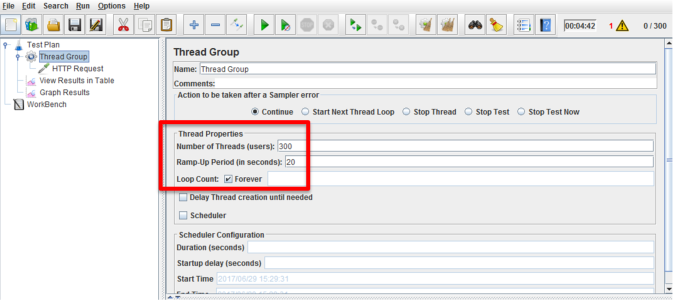
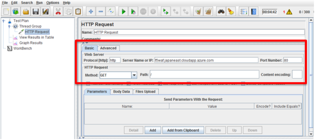

.. _module1:

パフォーマンス試験用アプリケーションの起動
====================================================

本ガイドでは Apache JMeter v3.2 を使用して F5 WAF 宛てのクライアント通信 (HTTP requests) をシミュレーションします。 

#. Thread Group を以下の例のように設定し、Azure の Scaleup イベントを発生させます 
   (パラメーターは試験環境に応じて、適宜調整して下さい)。 

   |perf_1|

#. 同様に、HTTP request を設定します。 

   |perf_2|
   

