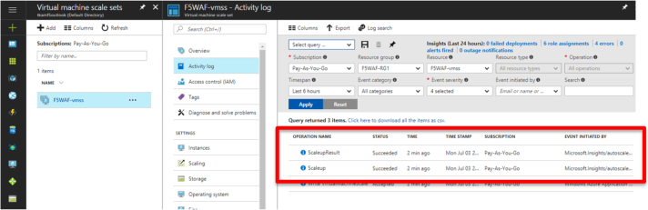
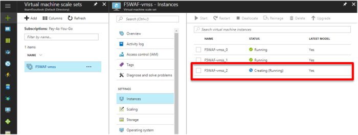
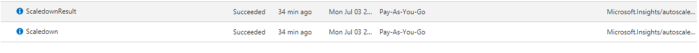

.. _module1:

SCALEUP イベントの確認
====================================================

#. Scaleup イベントの発生をログから確認します。 

   |scale_1|

#. 新しいインスタンスが作成されていることを **Instances** のステータスで確認します。
   起動後、インスタンスは自動的にトラフィックの処理を開始します。
   
   |scale_2|
   
#. トラフィック量がしきい値を下回ると、インスタンスは自動的に削除されます。

   |scale_3|
   
   

