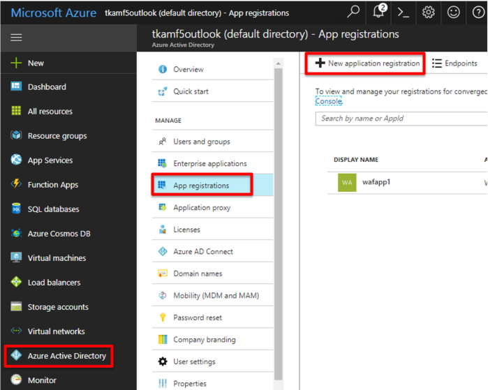
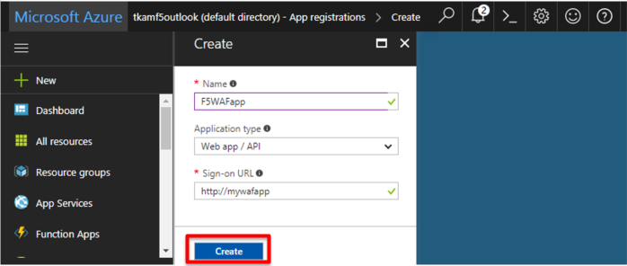

.. _module1:

ACTIVE DIRECTORY への WEB アプリケーションの登録
====================================================

アプリケーションでリソースにアクセスしたり変更を加えたりするには、Azure Active Directory (AD) アプリケーションをセットアップして、そこに必要な権限を割り当てる必要があります。 

#. Azure Portal (http://portal.azure.com) にログインします。

#. ハブメニューで **Azure Active Directory** を選択します。

#. **App registrations** を選択します。

#. **New application registration** を選択します。

   |adreg_1|
   
#. アプリケーションの名前と URL を指定します。作成するアプリケーションの種類として、
   **Web app / API** または **Native** を選択します。値を設定したら、 **Create** をクリックします。 
   
   |adreg_2|
   
   

