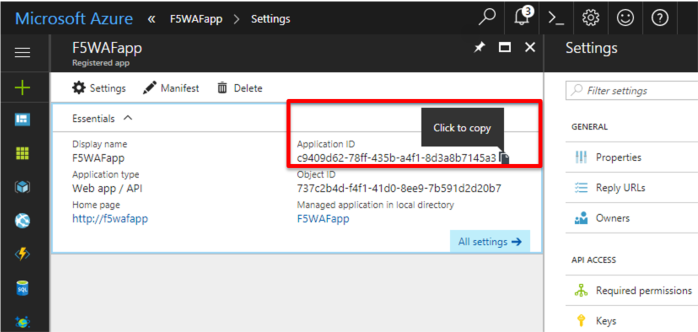
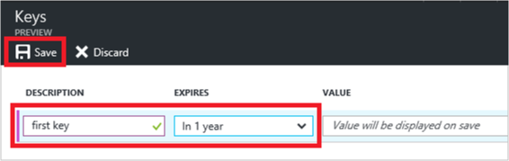
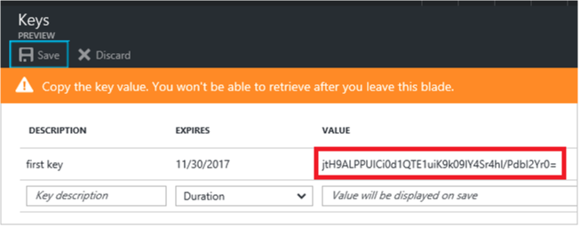
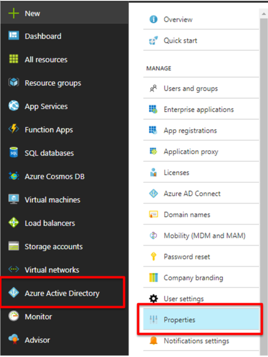
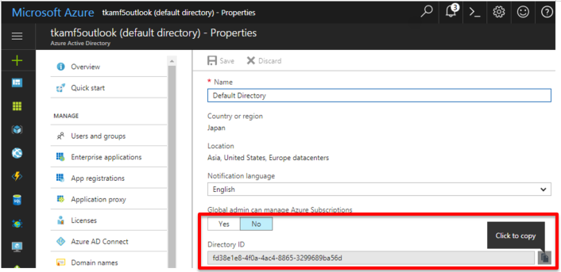
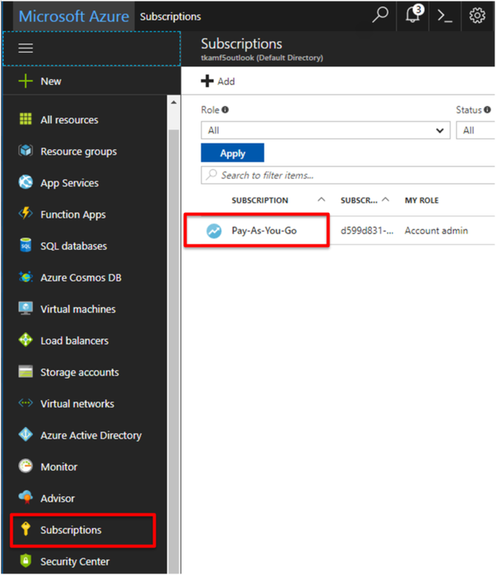
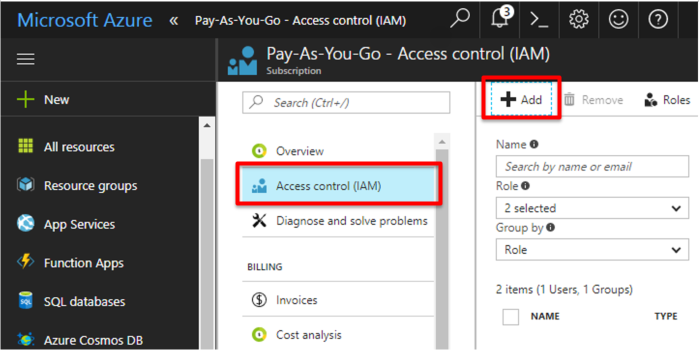
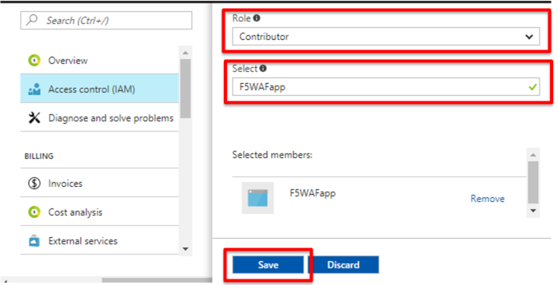

.. _module1:

アプリケーション ID と認証キーを取得する
====================================================

ARM テンプレートをデプロイするには、アプリケーションの ID と認証キーが必要です。これらの値を取得するには、次の手順に従います。

#. Azure Active Directory の **App registration** でアプリケーションを選択します。

#. アプリケーションID をコピーし、保存します (後の手順で利用します)。ARM テンプレートではこの値をクライアント ID として参照します。

   |appreg_1|
   
#. 認証キーを生成するには、 **Keys** を選択します。ARM テンプレートではこの値を servicePrincipalSecret として参照します。

#. キーの説明を入力し、キーの期間を指定します。操作が完了したら **Save** をクリックします。

   |appreg_2|
   
.. NOTE:: キーを保存すると、キーの値が表示されます。キーは後で取得出来ないため、この値をコピーしておきます。
   キー値は、アプリケーションとしてログインする際にアプリケーション ID と共に入力します。
   アプリケーションが取得出来る場所にキー値を保存します。
   
   |appreg_3|
   
テナント ID を取得する
====================================================

プログラムによってログインするときは、認証要求と共にテナント ID を渡す必要があります。

#. テナント ID を取得するには、 **Azure Active Directory** の **Properties** を選択します。

   |tenant_1|
   
#. ディレクトリ ID をコピーします。ARM テンプレートはこの値をテナント ID として参照します。
   
   |tenant_2|
   
アプリケーションをロールに割り当てる
====================================================

サブスクリプション内のリソースにアクセスするには、アプリケーションをロールに割り当てる必要があります。アプリケーションにとって適切なアクセス許可を表すのはどのロールであるかを判断します。利用可能なロールについては、 `RBAC: 組み込みのロール 
<https://docs.microsoft.com/ja-jp/azure/active-directory/role-based-access-control-what-is>`_ を参照して下さい。

このガイドでは、サブスクリプションレベルでアプリケーションに “Contributor” ロールを割り当てます。その結果、アプリケーションではサブスクリプション内のすべてのリソースを管理できます (アクセス権限は除く)。

#. サブスクリプションを選択し、サブスクリプションの種類を選択します。

   |role_1|

#. **Access control (IAM)** を選択し、次に **Add** を選択します。

   |role_2|

#. Contributor ロールを選択し、次にアプリケーションを検索して選択します。最後に **Save** をクリックして完了します。

   |role_3|

