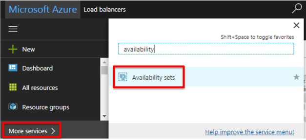

.. _module1:

WordPress インスタンスの Availability set 内へのデプロイ
====================================================

Availability sets は WordPress アプリケーションに冗長化機能を提供します。 

Availability set の作成
~~~~~~~~~~~~~~~~~~~~~~~~~~~~~~~~~~~~~~~~~~~~~~~~~~~~~

#. ハブメニューで **More services** を選択し、 **Availability sets** を検索します。

   |as_1|

#. **Add** をクリックし、表示された画面で以下のように設定します。終わったら **Create** をクリックします。

   |as_2|
   

.. |as_2| image:: images/as_2.png