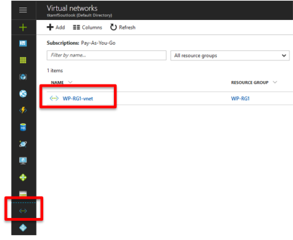
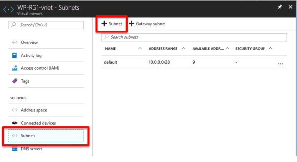
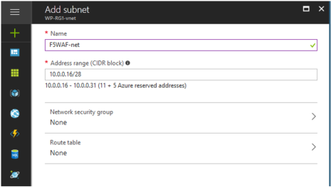

.. _module1:

F5 WAF サブネットの作成
====================================================

WordPress インスタンスと同一Vnet内にF5 WAF用のサブネットを作成します。

#. **Virtual Networks** をクリックし、既存のWordPressのVnetを選択します。

   |f5net_1|
   
#. **Subnets** を選択し、新規サブネットを作成するために **Subnet** をクリックします。

   |f5net_2|
   
#. 以下の通り設定し、 **OK** をクリックします。

   |f5net_3|
   

