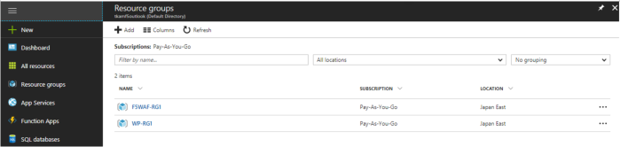

.. _module1:

WEB アプリケーション用のリソースグループ
====================================================

まず、ネットワーク構成図の通りにリソースグループを 作成します。

Web アプリケーション用のリソースグループ
~~~~~~~~~~~~~~~~~~~~~~~~~~~~~~~~~~~~~~~~~~~~~~~~~~~~~

本ガイドで利用する Web アプリケーション：WordPress × 2台が所属するリソースグループを作成します。 

#. **Resource groups** をクリックし、次に **Add** をクリックします。 

   |wprg_1|
   
#. 表示された画面で以下のように設定します。

   |wprg_2|
   
F5 WAF 用のリソースグループの作成
~~~~~~~~~~~~~~~~~~~~~~~~~~~~~~~~~~~~~~~~~~~~~~~~~~~~~

同様の手順で、BIG-IP 用のリソースグループを作成します。 

   |f5rg_1|
   

