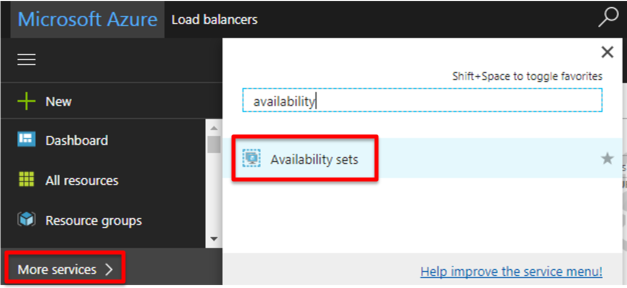
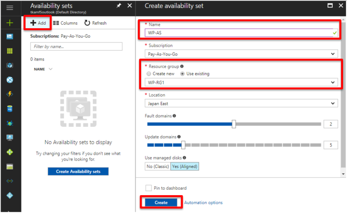

.. _module1:

WORDPRESS インスタンスのデプロイ
====================================================

前の手順で作成した WordPress インスタンス x 1 台が Availability set 内で起動するようにします。

#. ハブメニューで **Virtual machines** を選択し、 **Add** をクリックします。

   |wp_1|
   
#. 検索フォームに “wordpress” と入力し、Enter キーを押します。 

   |wp_2|
   
#. 本ガイドでは、以下の WordPress イメージを選択しました。

   |wp_3|
   
   |wp_4|
   
#. 基本設定の画面で以下の通り設定します。
   
   |wp_5|
   
#. 仮想マシンのサイズを選択します。
   このガイドでは一番小さい **A0** を選択しました。 

   |wp_6|
   
#. 前の手順で作成した Availability set を選択します。

   |wp_7|
   
#. 本ガイドでは、仮想ネットワークを以下のように /28 サブネットで分割して設定します。

   |wp_8|
   
#. Summary ページで全ての設定値を確認し、OK をクリックします。

   |wp_9|
   
#. デプロイが完了しましたら、以下の通りTAGを設定し、Saveを押します。

   |wp_10|
   

.. |as_3| image:: images/as_3.png
.. |as_4| image:: images/as_4.png
.. |as_5| image:: images/as_5.png
.. |as_6| image:: images/as_6.png
.. |as_7| image:: images/as_7.png
.. |as_8| image:: images/as_8.png
.. |as_9| image:: images/as_9.png
.. |as_10| image:: images/as_10.png
