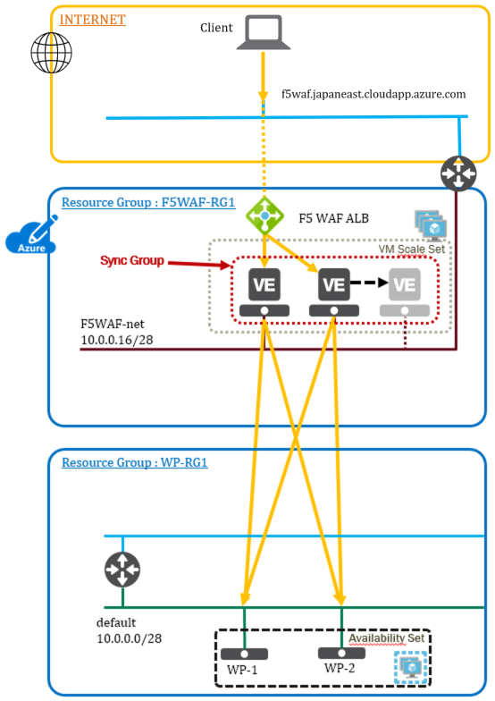

ネットワーク構成図
===================================================

このガイドで使用するネットワーク構成、およびコンポーネントは以下となります。 

   |nwzu_1|

+----------------------------------+---------------------------------+---------------------------------+
| **ネットワーク**                     | **アドレス空間**                   | **サブネット**                      |
+----------------------------------+---------------------------------+---------------------------------+
| 1.WordPress (WP-RG1)             | 10.0.0.0/24                     | 10.0.0.0/28                     |
+----------------------------------+---------------------------------+---------------------------------+
| 2. BIG-IP (F5WAF-RG1)            | 10.0.0.0/24                     | 10.0.0.16/28                    |
+----------------------------------+---------------------------------+---------------------------------+

