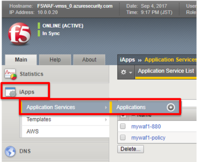
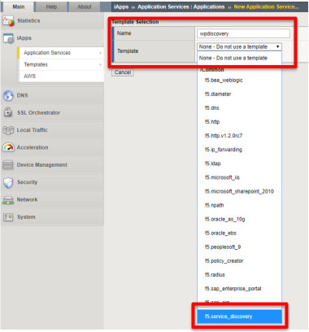
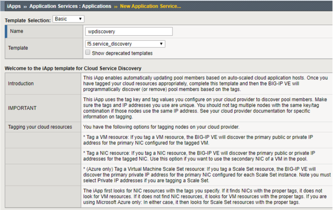
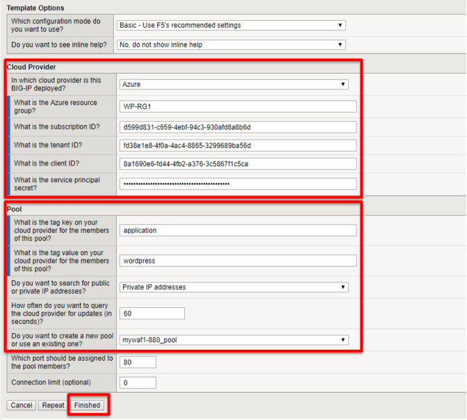

.. _module1:

SERVICE DISCOVERY用のIAPPをデプロイ
====================================================

Service Discovery機能の詳細に関しては、以下のリンクをご参照ください。

https://github.com/F5Networks/f5-azure-arm-templates/tree/master/supported/solutions/autoscale/waf/existing_stack#service-discovery

#. **iApps** > **Application Services** > **Applications** をクリックします。

   |svcdsc_1|
   
#. 新規 **Application Service** を作成するには、 **Create** をクリックします。

#. 任意の名前を入力し、 **f5.service_discovery** のテンプレートを選択します。

   |svcdsc_2|
   
#. 以下の通り設定します。

   .. NOTE:: Subscription IDはAzureポータル上のBillingで確認できます。
   
   |svcdsc_3|
   
   |svcdsc_4|
   

