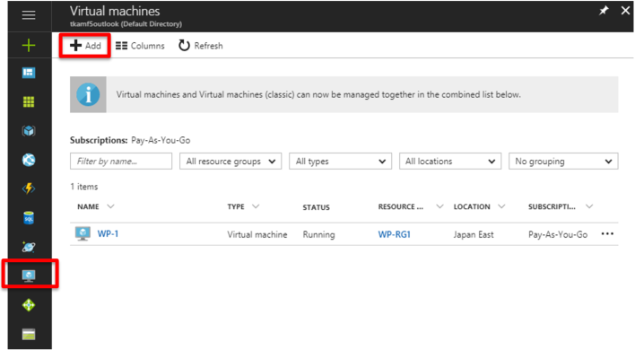
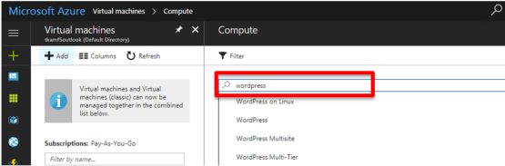
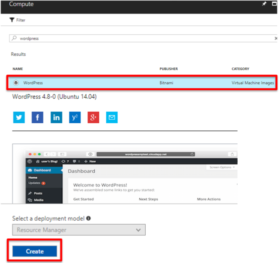
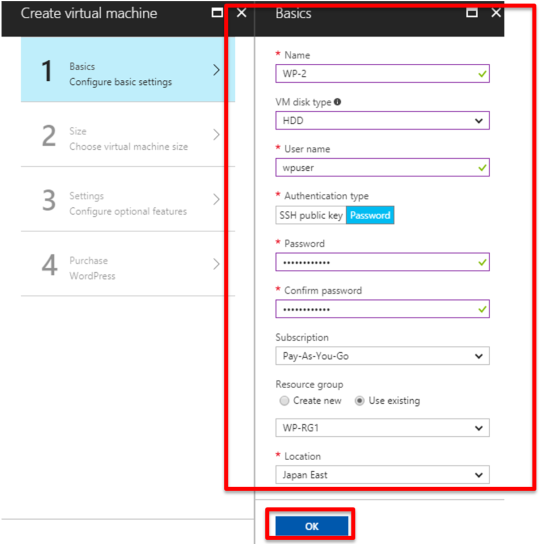
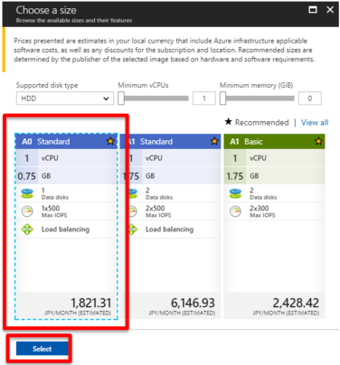
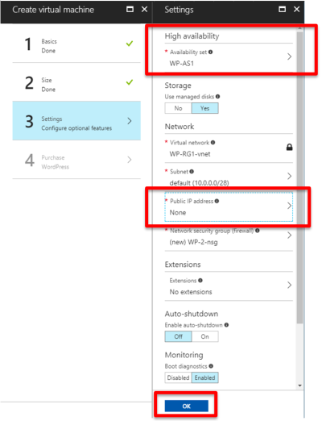
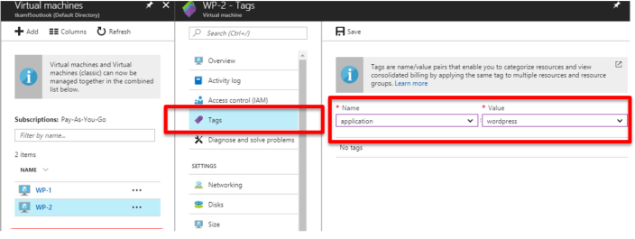
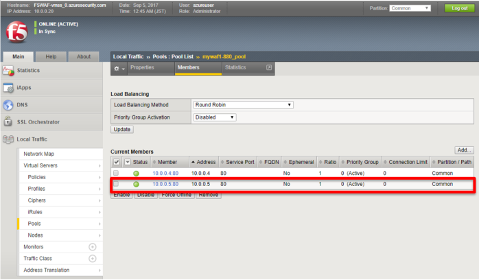

.. _module1:

2 台目の WORDPRESS インスタンスのデプロイ
====================================================

同じ手順で 2 台目の WordPress インスタンスを作成します。

#.  ハブメニューで **Virtual machines** を選択し、 **Add** をクリックします。

   |svcdsc_5|

#. 検索フォームに “wordpress” と入力し、 **Enter** キーを押します。 

   |svcdsc_6|
   
#. 本ガイドでは、以下の WordPress イメージを選択しました。

   |svcdsc_7|
   
#. 基本設定の画面で以下の通り設定します。

   |svcdsc_8|
   
#. 仮想マシンのサイズを選択します。

.. NOTE:: このガイドでは一番小さい **A0** を選択しました。 

   |svcdsc_9|
   
#. 前の手順で作成した Availability set を選択し、仮想マシンの Public IP address を削除します。
   **OK** をクリックします。
   
   |svcdsc_10|
   
#. デプロイが完了しましたら、１台目のWordPressインスタンスと同じ **Tag** を設定します。

   |svcdsc_11|
   
#. BIG-IPのGUIに戻り、追加された新たなWordPressインスタンスが自動的にプールに追加されたことを確認します。

   |svcdsc_12|
   

